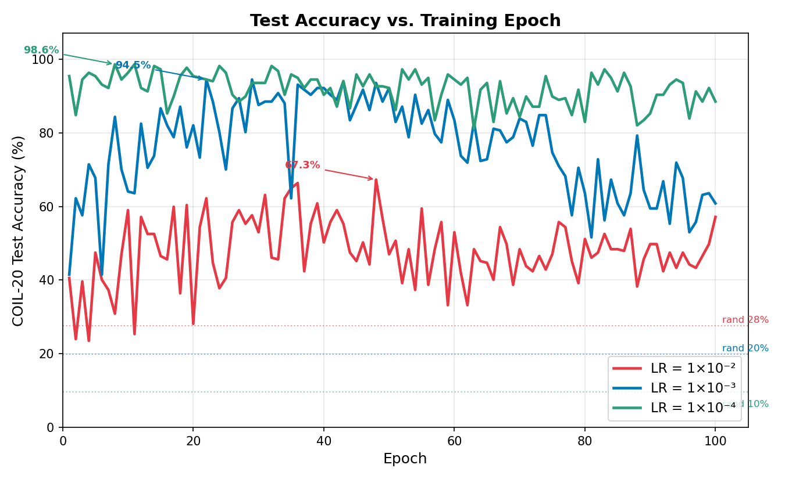
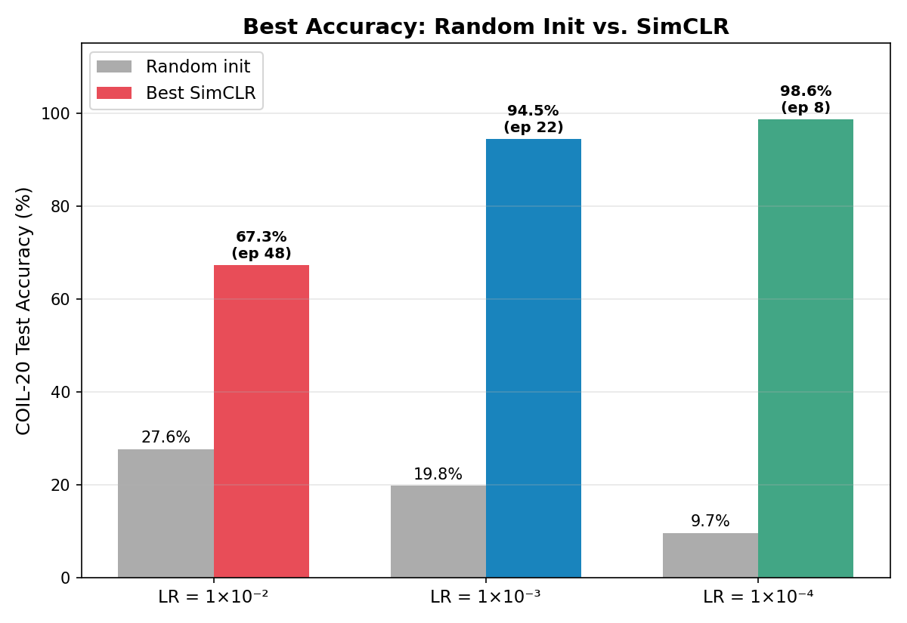
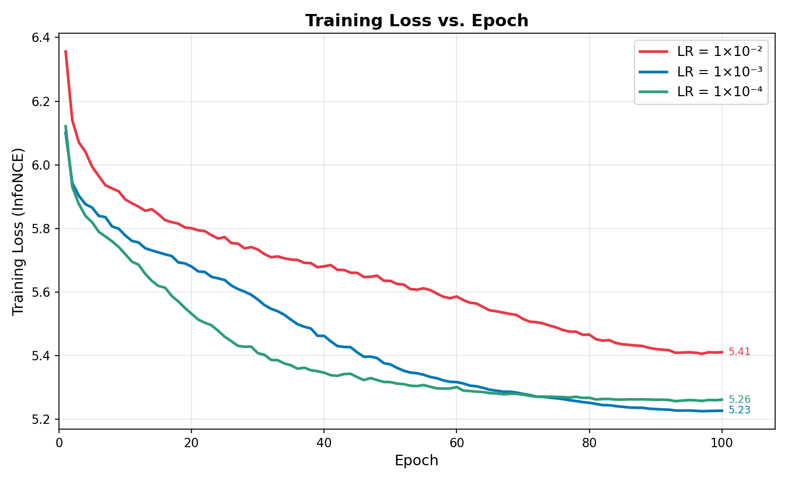

# Temporal Contrastive Learning from Egocentric Video

Self-supervised representation learning using temporal proximity as supervision.
Backbone: ResNet-18 · Dataset: COIL-20 · Loss: Multi-positive InfoNCE · Optimizer: AdamW + cosine LR decay

---

## What We Did

**Problem**
Learn visual features without any labels, using only the natural time structure of egocentric (first-person) video.

**Approach**
SimCLR with temporal positives — frames from the same short time window are positive pairs, frames from different windows are negatives. No manual annotations needed at any point.

**Setup**

| Parameter | Value |
|---|---|
| Backbone | ResNet-18 (randomly initialized) |
| Window size | 5 frames |
| Frame step | 2 frames between consecutive frames in a window |
| Window stride | 10 frames between consecutive windows |
| Loss | Multi-positive InfoNCE, temperature = 0.5 |
| Optimizer | AdamW with cosine LR decay |
| Training | 100 epochs, batch size 256 |

---

## Methodology

**Step 1 — Pretraining with Temporal SimCLR**

We train a ResNet-18 encoder using SimCLR on egocentric video frames. Instead of using image augmentations to create positive pairs (standard SimCLR), we use temporal proximity. Frames sampled from the same short time window are treated as positives — they likely show the same object or scene from a similar viewpoint. Frames from different windows are negatives.

For each video, we extract windows of 5 frames with a frame step of 2 (positions t, t+2, t+4, t+6, t+8). Each batch contains 256 windows. All frames pass through the encoder and a 2-layer projection head to produce 128-dimensional embeddings. The multi-positive InfoNCE loss pulls together all embeddings within a window and pushes apart embeddings from different windows.

**Step 2 — Downstream Evaluation (Linear Probe)**

After pretraining, encoder weights are frozen. A single linear classification layer is trained on top of the frozen features using COIL-20 (20 object classes, 1,440 images). This tests whether learned representations are useful for object recognition without fine-tuning the encoder.

**Step 3 — k-NN Retrieval**

The frozen encoder embeds all 1,440 COIL-20 images. We measure how well nearest neighbors in embedding space match the correct class label. No training is involved — a direct test of feature quality.

---

## Evaluation Protocol

- **Dataset:** COIL-20 — 20 object classes, 1,440 total images
- **Split:** 70% train (1007) / 15% val (216) / 15% test (217)
- **Three runs varying only learning rate:** 1×10⁻², 1×10⁻³, 1×10⁻⁴

---

## Results

### Test Accuracy vs. Training Epoch

| Epoch | LR = 1e-2 | LR = 1e-3 | LR = 1e-4 |
|---|---|---|---|
| Random init | 27.6% | 19.8% | 9.7% |
| 1 | 40.6% | 41.5% | 95.4% |
| 10 | 59.0% | 64.1% | 96.3% |
| 20 | 28.1% | 82.0% | 95.4% |
| 29 | 57.6% | **94.5%** | 93.5% |
| 40 | 50.2% | 92.2% | 90.3% |
| 48 | **67.3%** | 93.5% | 92.6% |
| 100 | 57.1% | 60.8% | 88.5% |

Best checkpoint for LR = 1e-4: **98.6% at epoch 11**

---

### Best Accuracy: Random Init vs. SimCLR

| Learning Rate | Random Init | Best SimCLR | Best Epoch |
|---|---|---|---|
| LR = 1e-2 | 27.6% | 67.3% | Epoch 48 |
| LR = 1e-3 | 19.8% | 94.5% | Epoch 29 |
| LR = 1e-4 | 9.7% | **98.6%** | Epoch 11 |

SimCLR gives 3–10x improvement over random initialization across all learning rates.

---

### Training Loss vs. Epoch

The contrastive loss saturates by epoch 10–20 across all runs. The temporal task becomes easy quickly — harder negatives are needed to keep the loss decreasing.

---

### k-NN Retrieval Accuracy

| k | Random Init | Best SimCLR (Epoch 6) |
|---|---|---|
| k = 1 | 99.9% | 99.9% |
| k = 5 | 99.4% | 98.9% |
| k = 10 | 98.7% | 97.2% |
| k = 20 | 94.9% | 94.6% |

> Note: COIL-20 is a small, clean dataset. High k-NN scores even for random features reflect dataset simplicity. Linear probe accuracy is the more informative metric.

---

## Conclusions

1. **Temporal proximity is a strong learning signal.**
   No labels needed — video time structure alone lifts accuracy from ~10–28% (random) to up to 98.6% on object recognition.

2. **Learning rate is the most important hyperparameter.**
   LR = 1e-4 reaches 98.6%. LR = 1e-3 reaches 94.5%. LR = 1e-2 stalls at 67.3%. Cosine decay helps stabilize all runs.

3. **Learned representations generalize.**
   Both linear probing and k-NN retrieval confirm the encoder learns class-discriminative structure without any supervision.

4. **The contrastive loss saturates early (epoch 10–20).**
   The temporal task becomes too easy — harder negatives are needed to continue improving.

---

## Next Steps

1. **Harder negatives** — MoCo-style memory queue or cross-scene hard negative mining
2. **Sweep temporal parameters** — vary frame step ∈ {2, 5, 10, 20} and window size ∈ {3, 5, 8}
3. **Evaluate on harder benchmarks** — ImageNet linear probe or action recognition
4. **Larger backbone** — ResNet-50 or ViT-Small; ResNet-18 may be the bottleneck
5. **Object-focus ablation** — background blurring is implemented but not yet evaluated
